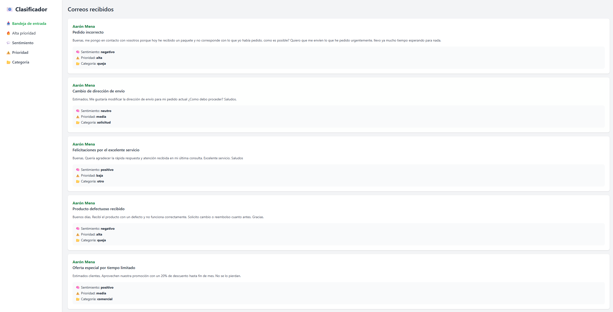
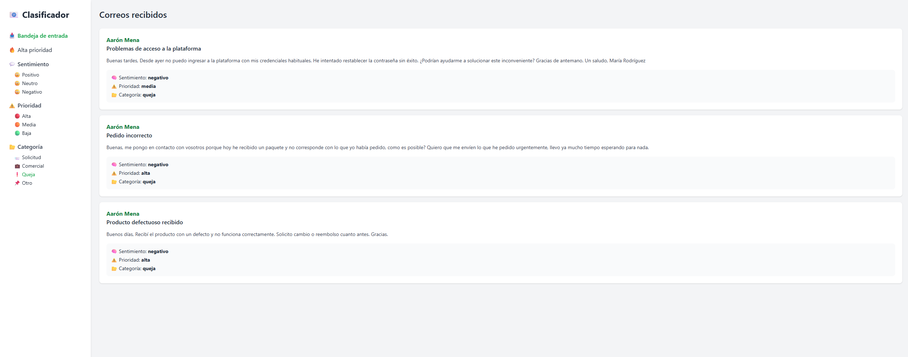
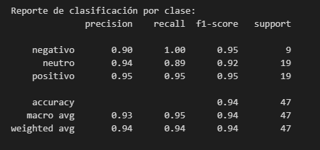
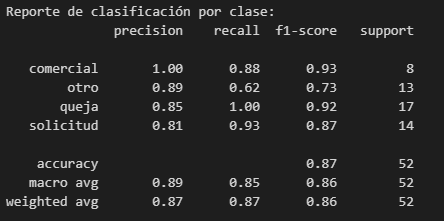
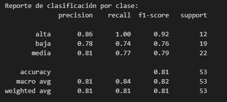

# Clasificador de Correos Inteligente

Este proyecto es una aplicación web que permite visualizar y clasificar automáticamente correos electrónicos usando modelos de lenguaje entrenados con Transformers. El sistema identifica el **sentimiento**, la **prioridad** y la **categoría** de cada correo recibido, y los presenta en una interfaz web clara e interactiva.

Está diseñado como un proyecto académico que combina ingeniería de software, procesamiento de lenguaje natural (PLN) y consumo seguro de APIs externas (Gmail).


## Arquitectura general

```
┌────────────────────────────────────┐
│ Fine-tuning supervisado (3 modelos)│
│ ─ Sentimiento                      │
│ ─ Prioridad                        │
│ ─ Categoría                        │
└──────────────┬─────────────────────┘
               │
               ▼
┌────────────────────────────────────┐
│ Subida de modelos a Hugging Face   │ 
└──────────────┬─────────────────────┘
               │               
               ▼
┌───────────────────────────────────────┐
│ Backend con Flask                     │
│ ─ Carga de modelos desde Hugging Face │
│ ─ Clasificación en tiempo real        │
└──────────────┬────────────────────────┘
               │
               ▼
┌────────────────────────────────────┐
│ Interfaz web con Tailwind          │
│ ─ Visualización de resultados      │
│ ─ Filtros interactivos             │
└──────────────┬─────────────────────┘
               │
               ▼
┌────────────────────────────────────┐
│ Conexión segura con Gmail          │
│ (lectura de correos mediante OAuth)│
└────────────────────────────────────┘

```

---

## Capturas de la app
A continuación se muestran algunas imágenes de la interfaz web desarrollada para visualizar y clasificar correos:

- En la bandeja de entrada se puede consultar rápidamente el contenido del mensaje junto con su análisis automático de sentimiento, prioridad y categoría.
- El menú lateral permite filtrar los correos por cualquiera de estas dimensiones, facilitando la gestión y priorización según necesidades reales.



Visualización general de los correos clasificados automáticamente.




Ejemplo de vista filtrada por categoría "queja", útil para acceder a correos que pueden ser prioritarios para responder de manera rápida.

---

## Modelos de clasificación

El sistema utiliza **tres modelos propios** basados en Transformers y alojados públicamente en Hugging Face. Cada uno ha sido entrenado desde cero con fine-tuning sobre el modelo base [`robertuito`](https://huggingface.co/pysentimiento/robertuito-base-uncased), específicamente para el español.

| Tarea         | Descripción                                           | Modelo Hugging Face                                                                 |
|---------------|-------------------------------------------------------|--------------------------------------------------------------------------------------|
| Sentimiento   | Clasifica como positivo, negativo o neutro           | [`sentiment-model-mailclassifier`](https://huggingface.co/aaronmena02/sentiment-model-mailclassifier) |
| Prioridad     | Determina si el correo es alta, media o baja         | [`priority-model-mailclassifier`](https://huggingface.co/aaronmena02/priority-model-mailclassifier)   |
| Categoría     | Detecta si es solicitud, comercial, queja u otro     | [`category-model-mailclassifier`](https://huggingface.co/aaronmena02/category-model-mailclassifier)   |

---

## Evaluación de los modelos

Cada modelo fue evaluado usando métricas estándar: precisión (`precision`), exhaustividad (`recall`) y `f1-score`, además de tests manuales con ejemplos reales. Aquí un resumen de los resultados más representativos:

### 1. Modelo de clasificación por sentimiento



**Análisis:**  
El modelo de clasificación de sentimiento ha demostrado un rendimiento muy sólido, especialmente en la identificación de correos negativos y positivos, donde obtiene un `f1-score` de 0.95 en ambos casos. La clase neutra es ligeramente más difícil de prede
cir, como suele ocurrir en problemas de PLN donde los matices son más ambiguos, pero aun así mantiene una puntuación respetable de 0.92.

El `recall` perfecto (1.00) en la clase negativa indica que el modelo rara vez deja pasar correos con tono negativo, lo cual es valioso en contextos donde este tipo de mensajes requieren atención prioritaria. El promedio general de métricas (macro y ponderado) confirma que el modelo es equilibrado y no favorece de forma significativa a ninguna clase, a pesar de las diferencias en frecuencia.

En conclusión, se trata de un modelo fiable para una primera versión funcional, con margen de mejora en la interpretación de matices más sutiles dentro de los correos neutros.

### 2. Modelo de clasificación por categoría



**Análisis:**  
El modelo encargado de clasificar la categoría del correo muestra un desempeño general sólido, con una precisión global (`accuracy`) del 87%. Destaca especialmente en la clase "queja", donde logra un `recall` perfecto (1.00) y un `f1-score` muy alto (0.92), lo que significa que es capaz de detectar prácticamente todos los mensajes de este tipo, algo clave en entornos donde se prioriza la atención al cliente.

También se comporta muy bien en la clase "comercial", con una precisión perfecta (1.00) y una capacidad razonable de recuperación (recall 0.88), lo que indica que, cuando predice que un mensaje es comercial, casi siempre acierta.

El principal margen de mejora se encuentra en la clase "otro", donde el `recall` baja a 0.62, lo que sugiere que esta categoría presenta más ambigüedad o solapamiento con otras clases. Aun así, el modelo mantiene un `f1-score` aceptable (0.73), y el rendimiento promedio (`macro avg` de 0.86) es bastante equilibrado.

En conclusión, se trata de un modelo eficaz para la mayoría de los casos, especialmente útil en aplicaciones prácticas donde se necesita separar rápidamente correos que requieren distintas acciones según su naturaleza.

### 3. Modelo de clasificación por prioridad



**Análisis:**

El modelo de prioridad obtiene un rendimiento general correcto, con una precisión global (`accuracy`) del 81%. Su punto más fuerte es la clase "alta", con un `recall` perfecto (1.00) y un `f1-score` de 0.92. Esto es especialmente valioso, ya que asegura que los correos urgentes no se pierdan, incluso si en algún caso se clasifica erróneamente otro como urgente.

En cambio, el rendimiento en las clases "media" y "baja" es algo más discreto. El `f1-score` de estas categorías (0.79 y 0.76 respectivamente) refleja cierta confusión entre ellas, algo comprensible dada su naturaleza más subjetiva. Aun así, el modelo mantiene un buen equilibrio entre precisión y `recall`, sin sesgos graves hacia ninguna clase.

Las métricas promedio (`macro avg` y `weighted avg`) también rondan el 81–84%, lo que indica un comportamiento estable en todos los casos.

En definitiva, el modelo es especialmente fiable para identificar prioridades altas, lo cual es clave en flujos de trabajo automatizados. Las demás clases, aunque algo más desafiantes, se manejan con una precisión aceptable.


## Subida de modelos a Hugging Face

Todos los modelos entrenados fueron subidos directamente al [Hugging Face Hub](https://huggingface.co/) desde la terminal utilizando la herramienta oficial `huggingface-cli`. Este enfoque evita los límites de almacenamiento de GitHub y facilita su integración en proyectos externos o despliegues.

## Pasos realizados
```bash
## 1. Iniciar sesión en Hugging Face
huggingface-cli login

## 2. Crear los repositorios remotos para cada modelo
huggingface-cli repo create sentiment-model-mailclassifier --repo-type=model
huggingface-cli repo create category-model-mailclassifier --repo-type=model
huggingface-cli repo create priority-model-mailclassifier --repo-type=model

## 3. Subir los archivos de cada modelo entrenado
Desde cada carpeta (sentiment_model, category_model, priority_model), se ejecutó el siguiente comando:

huggingface-cli upload ./sentiment_model --repo-id aaronmena02/sentiment-model-mailclassifier --repo-type model --commit-message "Versión inicial del modelo"
huggingface-cli upload ./category_model --repo-id aaronmena02/category-model-mailclassifier --repo-type model --commit-message "Versión inicial del modelo"
huggingface-cli upload ./priority_model --repo-id aaronmena02/priority-model-mailclassifier --repo-type model --commit-message "Versión inicial del modelo"

````

## Cómo ejecutar el proyecto

### 1. Clona el repositorio

```bash
git clone https://github.com/AaronMena02/MailClassifier.git
cd mail-classifier
```     
 p
### 2. Crea un entorno virtual

```bash
python -m venv .venv
source .venv/bin/activate  # En Windows: .venv\Scripts\activate
```

### 3. Instala las dependencias

```bash
pip install -r requirements.txt
```

### 4. Configura las credenciales de Gmail

1. Ve a [Google Cloud Console](https://console.cloud.google.com/).
2. Crea un nuevo proyecto.
3. Habilita la **Gmail API**.
4. Crea credenciales de tipo **OAuth 2.0 (Escritorio)**.
5. Descarga el archivo `credentials.json` y colócalo en la raíz del proyecto.

### 5. Ejecuta la aplicación

```bash
python app.py

# o también se puede ejecutar desde dentro de la carpeta flask introduciendo el comando      
flask run 
   
```

La primera vez se abrirá una ventana del navegador para autenticar tu cuenta de Gmail. Se guardará un archivo `token.json` para futuros accesos automáticos.

---

## Limitaciones de acceso

Este proyecto **no está verificado ni desplegado en producción** ya que se trata de un **proyecto académico de demostración** y no un producto de uso público. Por lo tanto:

- Solo puedes usar la app con cuentas registradas como testers en Google Cloud Console.
- Si otra persona intenta autenticarse, verá un error `403: access_denied`.

---

## Tecnologías utilizadas

- **Python 3.11+** como lenguaje de programación principal
- **Flask** como framework web
- **Hugging Face Transformers** para modelos de clasificación
- **Torch** para inferencia de modelos
- **scikit-learn** para evaluación de modelos y métricas
- **pandas** para manipulación del dataset
- **Gmail API + OAuth 2.0** para acceso a correos
- **Tailwind CSS** para diseño de la interfaz
- **JavaScript** para interactividad en el frontend

---

## Aprendizajes y objetivos

Este proyecto fue desarrollado como parte de una formación especializada en Inteligencia Artificial aplicada, con un enfoque práctico en el desarrollo de soluciones reales basadas en modelos de lenguaje (LLM). A lo largo del proyecto se consolidaron los siguientes aprendizajes clave:

- Aplicar técnicas de **fine-tuning de Transformers** sobre tareas de clasificación multiclase en lenguaje natural.
- Gestionar todo el ciclo de vida de un modelo: entrenamiento, evaluación, empaquetado y despliegue mediante Hugging Face Hub.
- Integrar modelos LLM entrenados en pipelines productivos con servicios web propios (Flask).
- Diseñar una arquitectura modular que separa claramente la lógica de inferencia, la interfaz de usuario y las integraciones externas (Gmail API).
- Desarrollar una aplicación realista centrada en el procesamiento y análisis automático de texto en español.

## Posibles mejoras futuras

Durante el desarrollo del proyecto se priorizó la modularidad y funcionalidad. Sin embargo, existen varias oportunidades de mejora para una futura evolución del sistema:

- **Unificación de modelos**: integrar los tres clasificadores (sentimiento, prioridad, categoría) en un único modelo multitarea (Multi-Head), reduciendo inferencias separadas y mejorando la eficiencia.
- **Batch inference**: adaptar el backend para realizar inferencia por lotes (batch) cuando se analicen múltiples correos simultáneamente, mejorando el rendimiento.
- **Entrenamiento con más datos reales**: ampliar el dataset con ejemplos reales etiquetados para reforzar especialmente clases minoritarias (por ejemplo, prioridad media o categoría "otro").
- **Deploy completo en la nube**: contenedorización con Docker y despliegue del sistema completo en servicios como Hugging Face Spaces, Render, Railway o GCP.
- **Sistema de feedback**: permitir al usuario corregir predicciones y almacenar esas correcciones para un futuro reentrenamiento continuo (active learning).
- **Compatibilidad multiusuario**: separar sesiones de Gmail por token para permitir el uso de múltiples cuentas en la aplicación.
